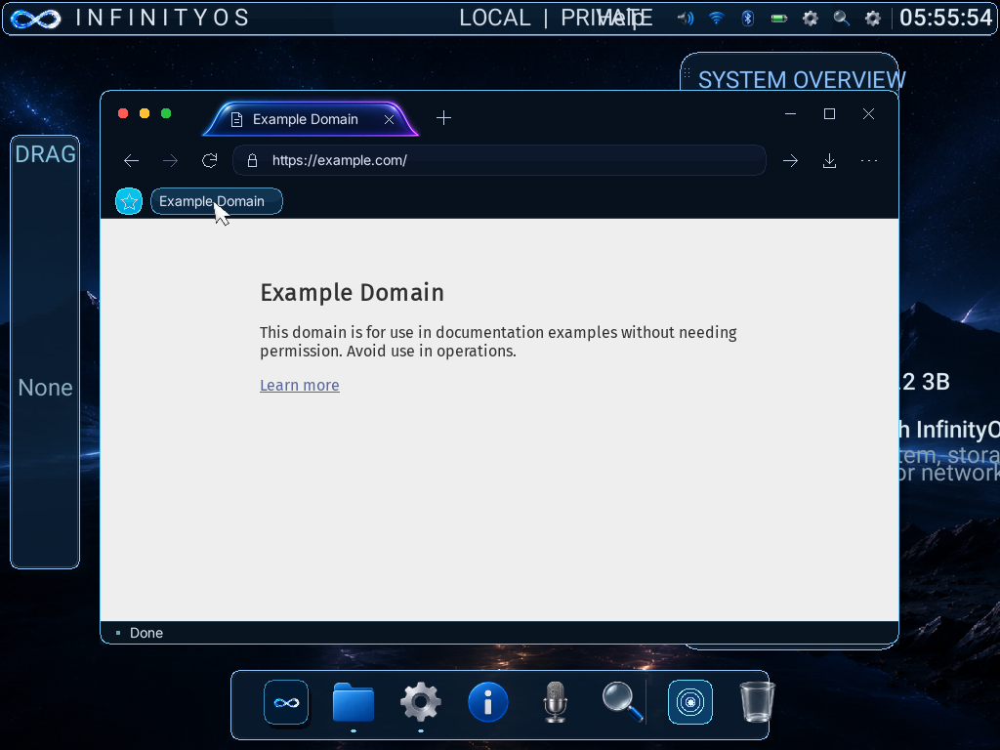

# Favorites and page status

Reuse the existing horizontal-tab glass artwork, native Inter 14 face, and
navy/cyan browser kit. No new raster artwork is needed for this text-first row.

- Keep the current 48px tab strip and 48px navigation toolbar unchanged.
- Add a 36px favorites strip immediately before the page. Use 16px gutters,
  28px hit targets, 8px gaps, a cyan saved star and quiet outline unsaved star.
- Star / Ctrl+D toggles the current HTTP(S) page. Saved titles are single-line,
  elided, and navigate on click. Previous/next controls expose overflow without
  shrinking labels or overlapping the page. Empty state explains the shortcut.
- Use a 24px footer, a 1px separator, a state-colored indicator, and a single
  measured line. Report loading with destination, loaded, startup failure,
  failed navigation/rendering, denied access, or durable favorite-save errors.
  Never invent percentages, transfer rates, or DNS/TLS phases.
- Save per-user private System Metadata objects with atomic bounded-history checkpoints.
  Publish changes only after durable success. Reject corrupt state without
  overwriting it; storage failures remain visible and are retryable.

Acceptance: native click/keyboard save, remove, navigation and overflow; codec
validation and capacity; per-user isolation; detached installed reboot
persistence; footer state transitions; content coordinates and tab regression;
rendered screenshot review.

## Verification — 2026-09-28

- 36 browser-core behavioral tests passed, including bounds, codec corruption,
  title/URL preservation, profile namespace keys, and status precedence.
- Native object-store tests passed private reads/copy rejection, separate
  profiles, 70 bounded-history saves, interrupted writes, and cold remount.
- Fresh ARM installation matched its ISO payload byte for byte. Detached-disk
  tests passed Ctrl+D/star add/remove, saved-page navigation, and power-off/reboot
  persistence. Receipts: `build/browser-installed-1790574347116690000/`.
- A focused installed update passed overflow paging, failed-destination identity,
  loading/error presentation, and successful navigation after a page failure.
  Screenshots were reviewed, not accepted solely from compiler success.
- The final installed label regression passed: a second page with the same
  document title retains that title in saved favorite data instead of falling
  back to its URL (`--favorites-label`).
- The broader CSS/image/input/tab fixture run did not pass: httpbun.com timed
  out from the host and guest; a httpbin.org trial also failed native transport.
  Do not cite that run as browser-interaction regression evidence. The original
  fixture remains unchanged; no timeout or trust-validation relaxation was made.
- This is ARM validation, not x86 installed proof or a clean-release claim.

Final ARM ISO build manifest: `20260928T062010124131Z-85674.json`.
SHA-256: `b6d3effd3afe040121c10bd451ec1d1b1187182bc9281e4a7a762d45542993e9`.

