# Settings UI and UX Kit — v1

## Scope and acceptance

Eleven category boards accompany this specification. The raster boards are **generated visual concepts**, not screenshots of the implemented OS or proof of feature completion. Generated example names, numbers, and extra controls are not authoritative. The functional inventories below are authoritative for this pass; backend features must not be invented to match incidental image text.

The request for 100% visual matching remains unaccepted until every production screen and expanded state has been captured and reviewed. Compilation and layout tests alone do not establish visual parity.

## Shared visual contract

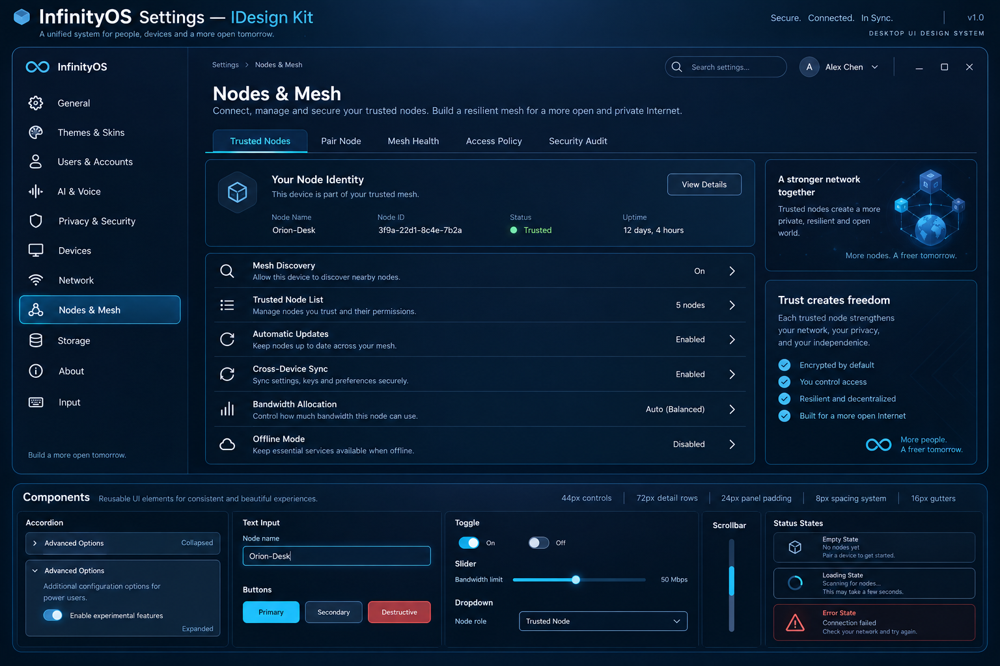

- Material: midnight navy tinted glass, soft cyan outline, restrained highlight; retain the user's appearance colors and opacity.
- Hierarchy: fixed window chrome and navigation; section title and description; independently scrolling content.
- Navigation: one selected rounded row, no decorative thin bands behind inactive labels. Current icon pack remains in use.
- Spacing: 12 logical-pixel dashboard gaps; 24-pixel panel inset; 72-pixel minimum standard summaries with 12-pixel separation; 80-pixel minimum two-line Nodes controls.
- Tabs: 44-pixel minimum height, 12-pixel gaps, wrapping rather than squeezing. Nodes minimum width184; Network112. Narrow dashboard detail panels stack below controls.
- Text: native antialiased UI font, centered vertically; never shrink readable text to fit compressed authored geometry. Long content must truncate or wrap, never paint into another control.
- Overflow: clip to viewport, keep lower controls reachable, and use identical geometry for painting and hit testing.
- Expanders: one open detail well; subsequent rows shift by its full height. Read-only wells must not contain implied save actions.
- State: selected, focus, hover, expanded, disabled/unavailable, loading, failure and empty states must be distinguishable without invented data.
- Window controls: visible glyph centers and hit targets coincide.
- Expanded actions: a shared 240-logical-pixel bounded width reserves room for the action label and affordance; paint and hit testing use the same width.
- Runtime: retain persistent surfaces; the design does not authorize recurring whole-desktop repaint or service calls per pointer motion.

## Category kits

### General

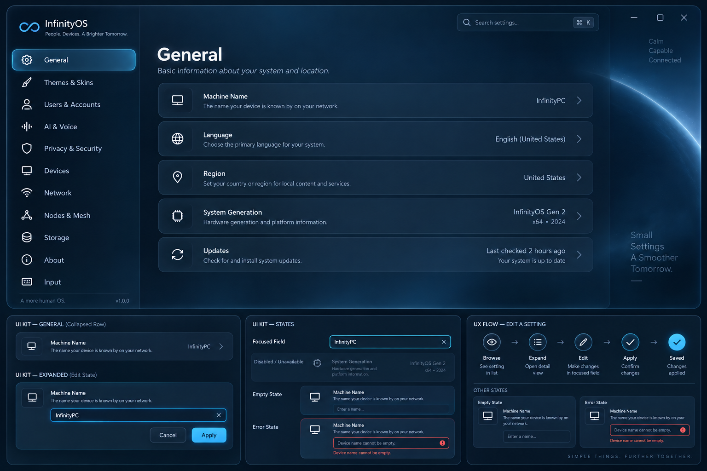

**Inventory:** Machine name · Language · Region · System Generation · Updates.

**Controls and expanders:** Machine name expands to Edit name; editing uses the durable identity service. Other rows are inspection-only; do not imply that locale or updates can be edited.

**UX contract:** Rename → enter a valid name → save → show the authoritative saved name. Collapsing a row restores its original height.

**Review:** capture collapsed, each supported expanded state, narrow viewport, scrolled bottom, and keyboard/pointer activation. Inspect padding, clipping, legibility, focus, and truthful runtime values.

### Themes & Skins

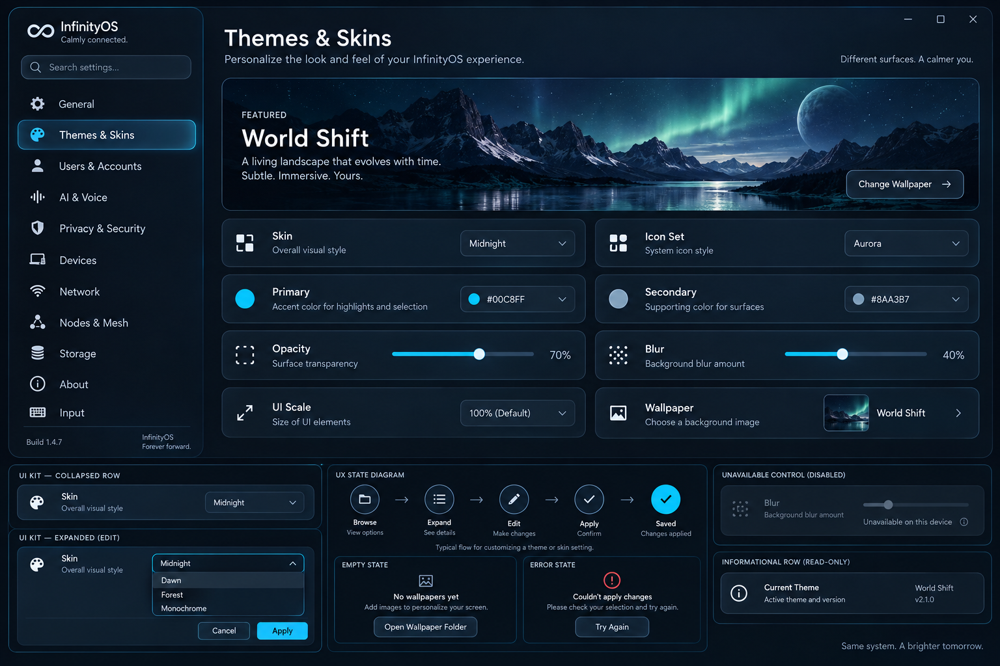

**Inventory:** Skin · Icon set · Primary · Secondary · Opacity · Blur · UI scale · Wallpaper; World Shift hero.

**Controls and expanders:** Skin switches installed skins. Icon previews select installed packs. Primary/secondary open color controls. Opacity and blur open sliders. Wallpaper opens the packaged gallery. Automatic UI scale is information, not an editable slider.

**UX contract:** Preview → select → persist user appearance → update all consumers. World Shift opens its separate working interface.

**Review:** capture collapsed, each supported expanded state, narrow viewport, scrolled bottom, and keyboard/pointer activation. Inspect padding, clipping, legibility, focus, and truthful runtime values.

### Users & Accounts

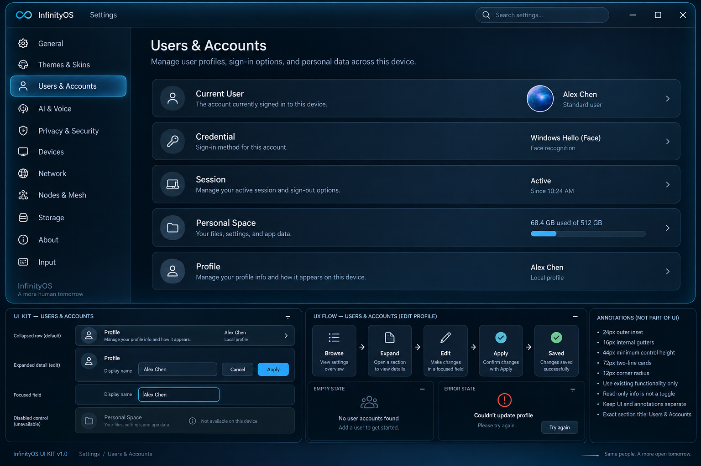

**Inventory:** Current user · Credential · Session · Personal Space · Profile.

**Controls and expanders:** These are inspection rows in the current native Settings implementation. No decorative Add user, password change, or permission editor is accepted as a functioning control.

**UX contract:** Expand → inspect current identity/session information → collapse. Authentication changes stay in the existing trusted identity workflow.

**Review:** capture collapsed, each supported expanded state, narrow viewport, scrolled bottom, and keyboard/pointer activation. Inspect padding, clipping, legibility, focus, and truthful runtime values.

### AI & Voice

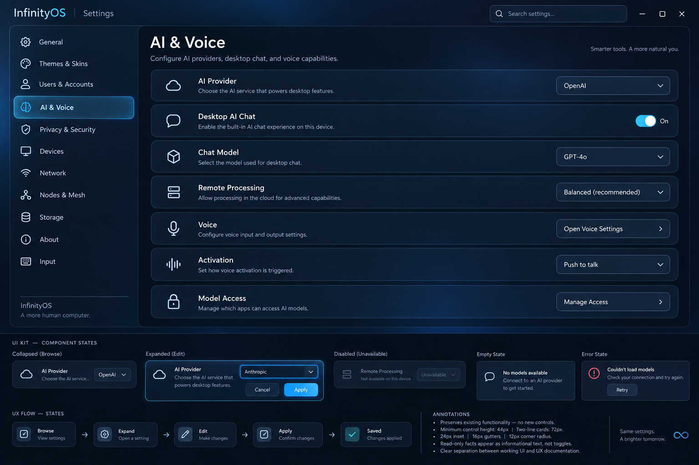

**Inventory:** AI provider · Desktop AI chat · Chat model · Remote processing · Voice · Activation · Model access.

**Controls and expanders:** Provider policy has Change policy; chat has Enable/Disable chat; model has Next model. Other rows describe restrictions. Never present uninstalled models as ready.

**UX contract:** Expand model → next installed model → updated selected model. Preserve cancellation, capability checks, and the Local ML boundary.

**Review:** capture collapsed, each supported expanded state, narrow viewport, scrolled bottom, and keyboard/pointer activation. Inspect padding, clipping, legibility, focus, and truthful runtime values.

### Privacy & Security

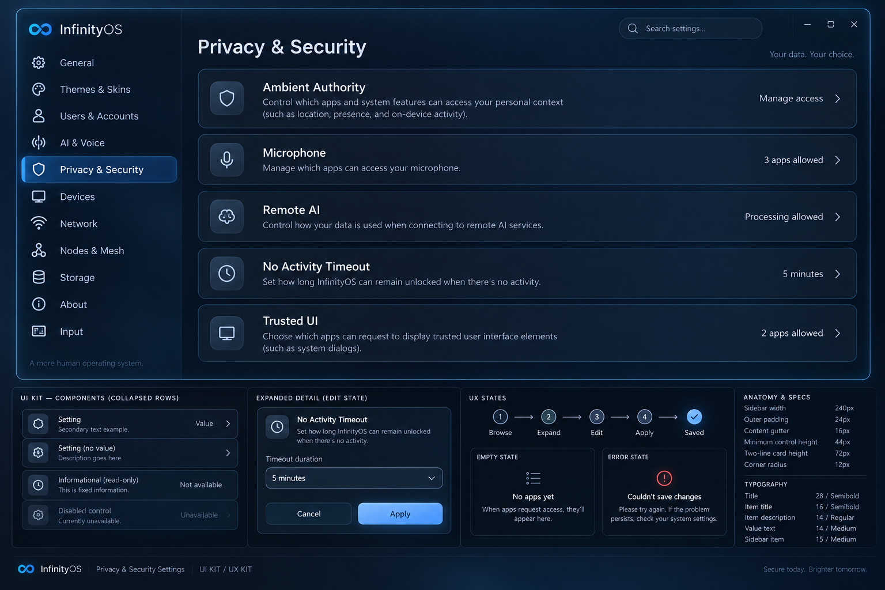

**Inventory:** Ambient authority · Microphone · Remote AI · No-activity timeout · Trusted UI.

**Controls and expanders:** Timeout expands to the existing bounded user-session slider. Other rows are status/inspection; this design does not grant capabilities.

**UX contract:** Adjust timeout → persist → session lock uses the selected interval. No UI-only claim of changed security policy.

**Review:** capture collapsed, each supported expanded state, narrow viewport, scrolled bottom, and keyboard/pointer activation. Inspect padding, clipping, legibility, focus, and truthful runtime values.

### Devices

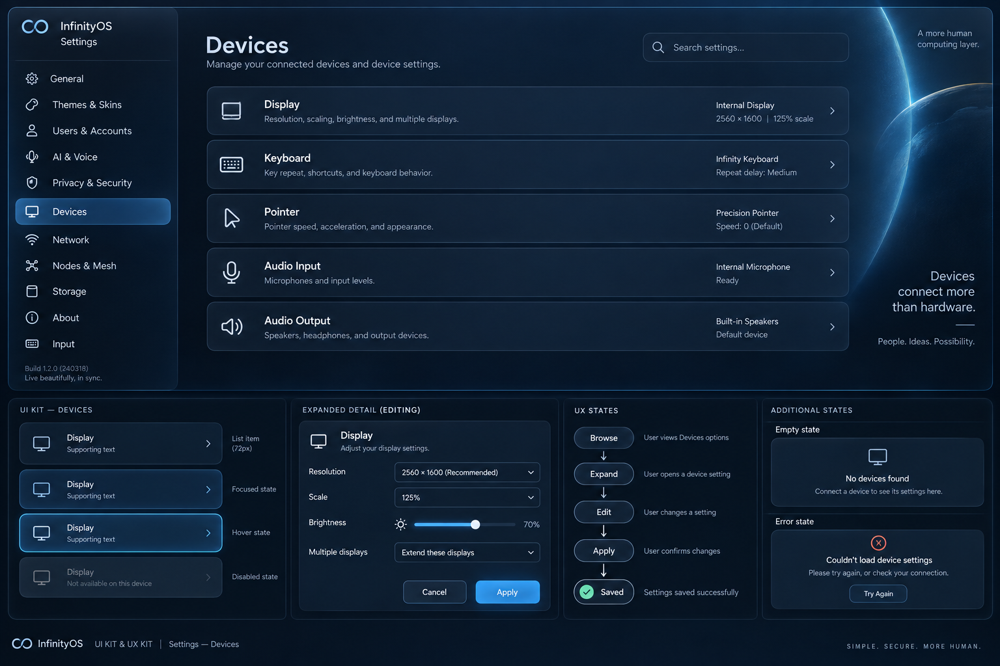

**Inventory:** Display · Keyboard · Pointer · Audio input · Audio output.

**Controls and expanders:** Pointer expands to the real cursor gallery. Unsupported audio states remain visibly unavailable rather than active controls.

**UX contract:** Open pointer gallery → select packaged cursor → preview and persist. Other rows inspect observed availability.

**Review:** capture collapsed, each supported expanded state, narrow viewport, scrolled bottom, and keyboard/pointer activation. Inspect padding, clipping, legibility, focus, and truthful runtime values.

### Network

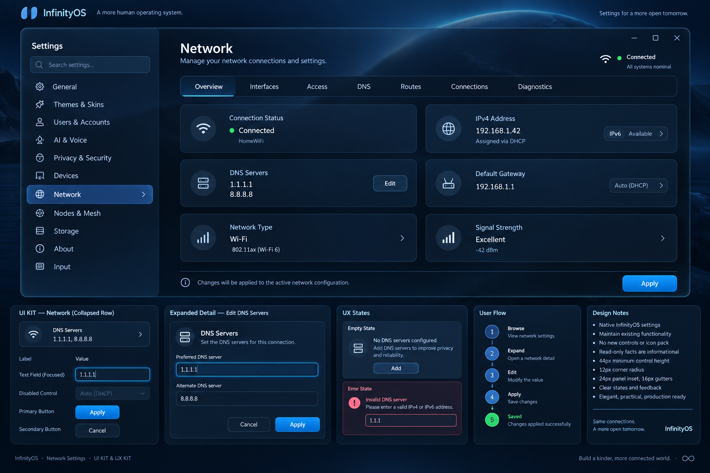

**Inventory:** Overview · Interfaces · IPv4 · DNS · Routes · Profiles · Policy.

**Controls and expanders:** Seven responsive tabs; summary, six page-specific controls, and a supporting detail panel. Keep current native editor/validation paths and report actual connectivity.

**UX contract:** Select tab → inspect or edit its field → submit through the network service → reflect observed result. Wrap tabs and stack detail panel at narrow widths.

**Review:** capture collapsed, each supported expanded state, narrow viewport, scrolled bottom, and keyboard/pointer activation. Inspect padding, clipping, legibility, focus, and truthful runtime values.

### Nodes & Mesh

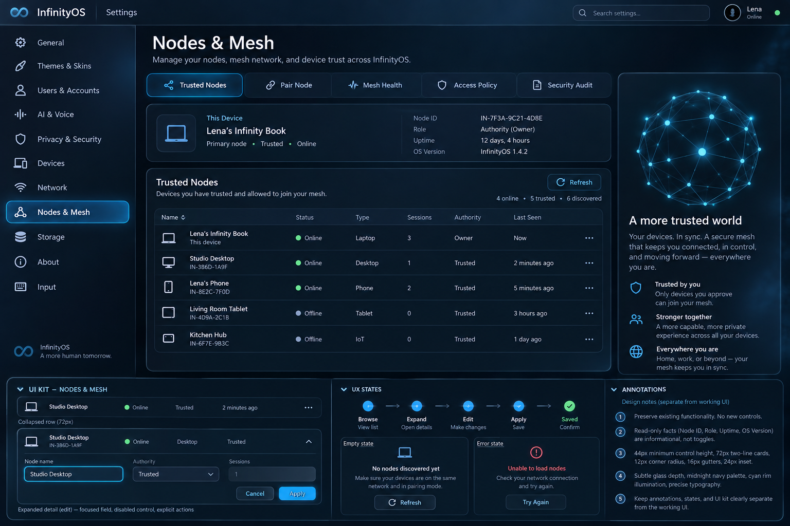

**Inventory:** Trusted nodes · Pair node · Mesh health · Access policy · Security audit.

**Controls and expanders:** Five responsive tabs. Each has six page-specific actions/status rows. Pairing details contain verification/code/expiry state; policy pages retain capability categories. Discovery is not trust and trust is not authority.

**UX contract:** Discover → select identity → verify → pair through existing flow. Never automatically trust a discovered node. Policy, leave-domain, audit/export remain explicit actions.

**Review:** capture collapsed, each supported expanded state, narrow viewport, scrolled bottom, and keyboard/pointer activation. Inspect padding, clipping, legibility, focus, and truthful runtime values.

### Storage

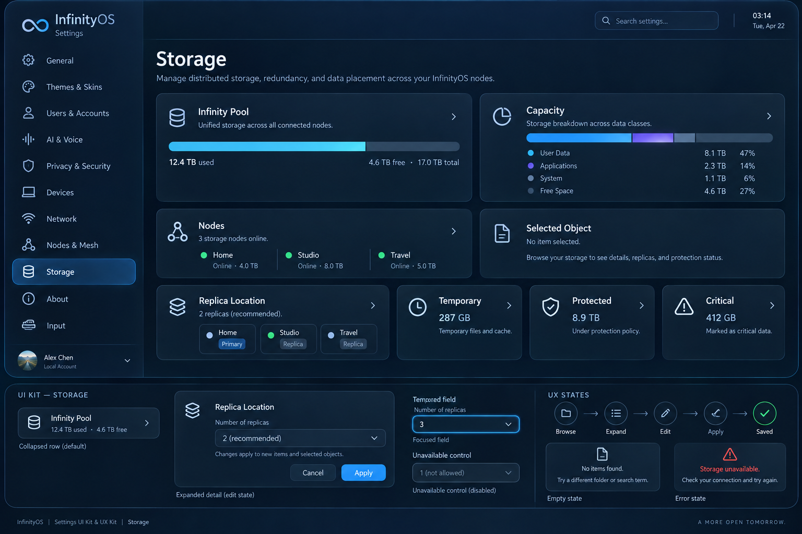

**Inventory:** Infinity Pool · Capacity · Nodes · Selected object · Replica location · Temporary · Protected · Critical.

**Controls and expanders:** Pool/capacity refresh authoritative state; Nodes/Object/Replica cycle observations; durability rows set policy for the selected object. No object means no enabled policy action.

**UX contract:** Inspect → select object → inspect placements → choose supported durability policy → show authoritative outcome. Do not substitute fabricated healthy counts.

**Review:** capture collapsed, each supported expanded state, narrow viewport, scrolled bottom, and keyboard/pointer activation. Inspect padding, clipping, legibility, focus, and truthful runtime values.

### About

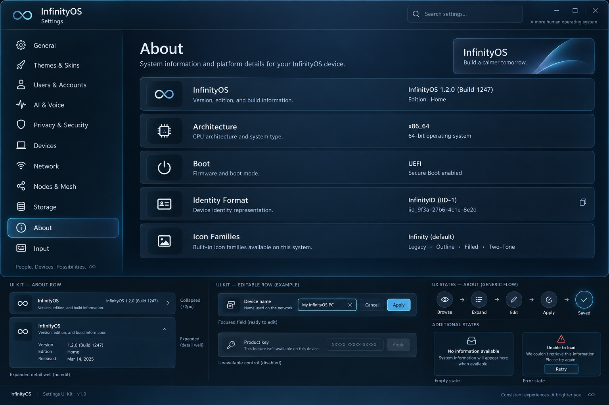

**Inventory:** InfinityOS · Architecture · Boot · Identity format · Icon families.

**Controls and expanders:** Read-only expanders. Do not add fake update/version/support buttons or fabricated build numbers.

**UX contract:** Inspect the installed generation and platform information. All long values remain bounded within the row.

**Review:** capture collapsed, each supported expanded state, narrow viewport, scrolled bottom, and keyboard/pointer activation. Inspect padding, clipping, legibility, focus, and truthful runtime values.

### Input

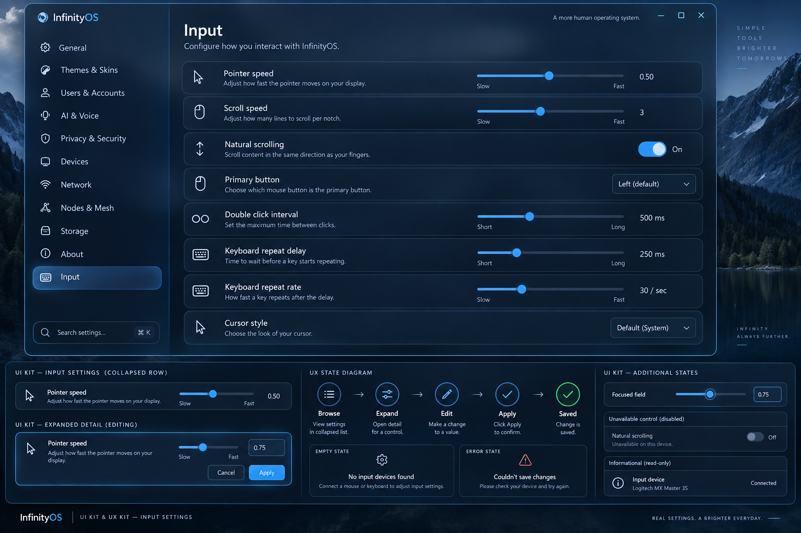

**Inventory:** Pointer speed · Scroll speed · Scroll direction · Primary button · Pointer acceleration · Key repeat delay · Key repeat rate · Reset input defaults.

**Controls and expanders:** These eight rows are immediate-action preferences, not disclosure wells. Preserve the current bounded cycle/reset behavior and persistence.

**UX contract:** Activate a row → next supported value → immediately reflected preference. Reset restores defaults; do not show a nonfunctional Apply button.

**Review:** capture collapsed, each supported expanded state, narrow viewport, scrolled bottom, and keyboard/pointer activation. Inspect padding, clipping, legibility, focus, and truthful runtime values.

## Evidence ledger

- `tools/settings-overflow-test.sh`: executable production geometry/cache/hit-target assertions. Covers all eleven category definitions, normal-row expansion and scroll, Nodes/Network dashboard flow, and configuration-network targets.
- `tools/settings-installed-test.py`: disposable fresh x86 installation with ISO removed, pointer-driven transitions, structured guest state, and screenshots. The initial fresh-install run verified General, Themes, and Privacy interactions. The category review navigates all eleven sections and captures their actual render; representative first-row disclosures are checked on the eight disclosure-based pages. This is not every backend workflow or every expanded state.
- `make x86_64` / `make aarch64`: compilation and installer artifact construction, not visual acceptance.
- Generated boards intentionally remain documentation assets, not runtime wallpaper baked into interactive controls.
- This pass must retain the existing packaged Settings template and installed-kernel path. No live-ISO-only implementation is acceptable.

## Known acceptance gaps

Exact board-to-screen visual parity remains pending. The concept boards include compositional variations and incidental controls not supported by the current product; those are not implemented features. All-category navigation has been exercised, but every expanded state, dashboard subtab and backend mutation has not been accepted. Existing inspection-only categories remain inspection-only. In particular, provider-policy summary copy needs to be driven by saved policy rather than its existing fixed label. This pass is a verified layout correction and design foundation, not evidence of 100% completion of the requested redesign.
